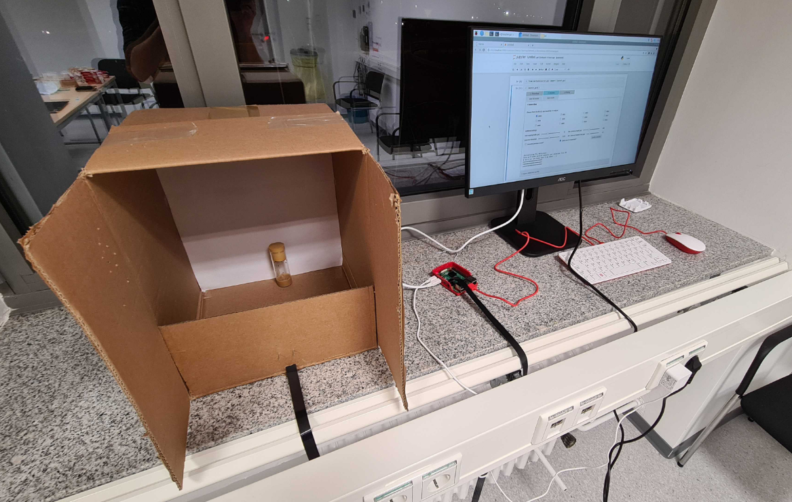
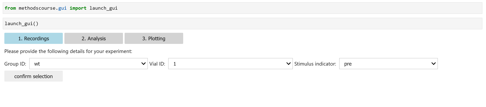
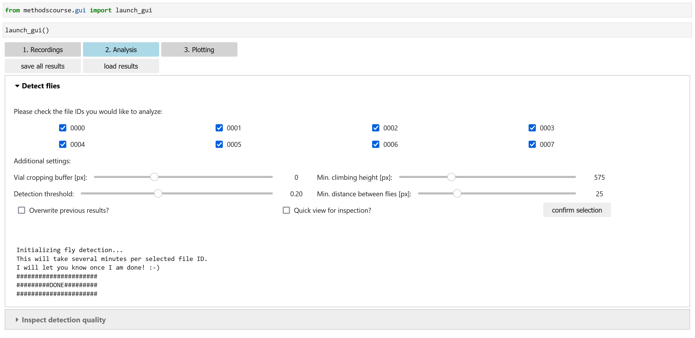
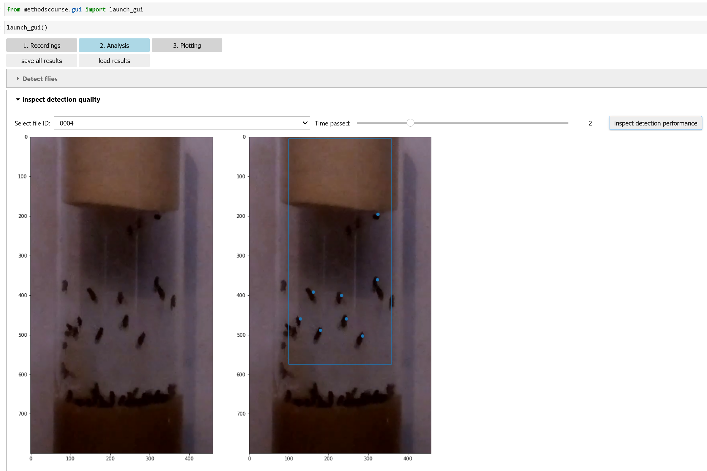
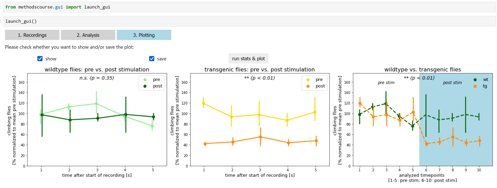

# Methods in Neuroscience - 2022 Edition

This repository complements the two courses "Introduction to python programming to control and analyze an optogenetic behavioral experiment" 
and "Investigating neuronal circuit function with optogenetics" by the [Defense Circuits Lab](https://www.defense-circuits-lab.com/).
The overarching goal of these two courses is to give students a little sneak-peak into what elements are part of an experiment 
in modern systems neuroscience nowadays. 

## The experiment

In a nutshell, the students conduct an optogenetics experiment with two groups of adult *Drosophila melanogaster* and assess their locomotor behavior 
using a custom written software tool. While wildtypic flies are used as control group, the GAL4-UAS-system is utilized to restrict the expression 
of a channelrhodopsin-variant to motorneurons in transgenic flies that compose the experimental group.

## The task

In the first course, students will get a very basic introduction into programming in Python and will be guided through the process of creating a 
custom written software tool to record and analyze the experiment. For this, students will be provided with Raspberry Pi systems.

In the second course, students will get a comprehensive introduction into optogenetics and will then be guided through the process of designing the experiment.
Once this theoretical part is concluded, the students will use the software tool created in the first course to actually conduct and analyze the experiment.

## The result

Over the course of these two weeks, we developed a GUI that allowed us to record the experimental trials, process the data, perform statistical analyses,
and eventually visualize the results of the experiments that we conducted:

## Additional insights

Below, you can also find an image of the experimental setup as well as some screenshots of the custom written GUI:

**The experimental setup**

We were using a Raspberry Pi 4B (4 GB RAM) and a Raspberry Pi camera module (8MP, v2) to record short (8 s) videos of adult *Drosophila melanogaster* prior to
and after 30 seconds exposure to a strong white light source:

The software tool that we created to record and analyze the experiments was based on interactive widgets (Ipywidgets) in a virtual notebook (Jupyter Notebook).
It allowed us to acquire the data:

and also to process the recorded data in order to be able to perform statistical analysis. In our case, this required the detection of flies, which was achieved
by using a relatively straightforward template matching approach. 

While this is surely not fully optimal yet, it yielded sufficiently good results:

Finally, the GUI also enabled us to compute the statistical analyses (Repeated-measures ANOVA for the comparison of pre- vs. post- stimulation within each group; 
Mixed-Models ANOVA for the comparison between wildtype and transgenic flies) and to plot the data:

## Concluding remarks

We hope this course was as much fun for all students as it was for us during its preparation. In case you should have any questions to the code or would like to test it
on the actual data that we recorded (which we could not upload to this repository due to space limits), please feel free to contact us
(for instance via e-mail: Segebarth_D@ukw.de)!

Furthermore, we would like to thank our colleagues who generously provided us with the flies used in this course!

